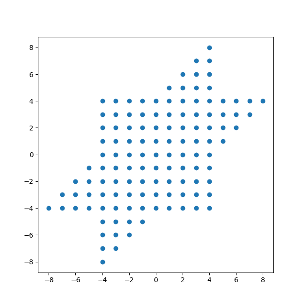
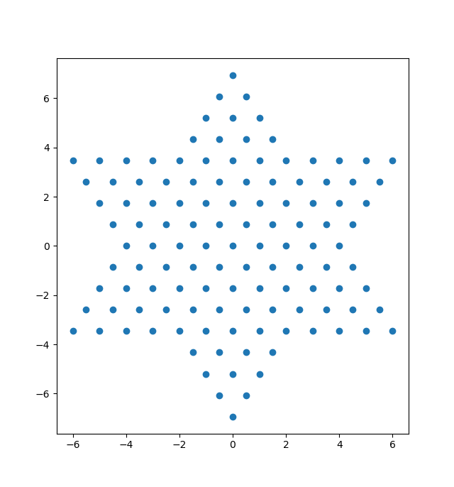

# 实验报告
[toc]

# 1.功能分析
## 1.1 StopInvolution程设跳棋游戏的基本功能
- 友好的图形界面
- 支持 1,2,3,4,6 人游戏
- 支持 AI 托管
- 支持不同玩家在局域网联机
## 1.2 跳棋规则
1. 相邻移动
2. 相邻跳跃
3. 允许连跳，但是移动和跳跃不满足相继的条件
4. 不允许不相邻跳跃，或者说一般的等距跳跃是不被允许的
5. 不允许轮空
6. 不做消极游戏判断
7. 按照完赛先后排名
# 2.游戏流程设计
## 2.1 等待房准备
1. 玩家首先进入等待房间，此时玩家可以修改自己的昵称
2. 随后玩家选择游戏桌坐入，坐入后自动进入棋盘(下棋界面)
## 2.2 加入房间，准备开始
1. 开始游戏前每个玩家可以自由选择座位方位
2. 开始游戏前每个玩家可以指定位置加入机器人
3. 开始游戏前每个玩家可以选择游戏人数(1,2,3,4,6,自动),默认为自动，自动会优先选择向上最近的一个合法游戏人数。棋盘人数和游戏设定人数的差用托管机器人填补
## 2.3 开始游戏
1. 每个玩家都可以点击”开始游戏“开始游戏
2. 开始游戏后如果玩家的座位方位不符合规则会按“相对位置不变”调整，自动添加的机器人会出现在最后
3. 开始游戏后房间会拒绝其他玩家的加入
## 2.4 游戏中
1. 玩家选择棋子后可以获得合法落子位置提示 
2. 玩家可以随时启用托管或获得托管的建议行棋方式
3. 托管的智能程度可通过设置定义
# 3. 分工
- 潘俊达:跳棋基本界面实现+跳棋底层逻辑实现
- 贾昊霖:网络接口接入+多人交互界面功能实现
- 程云飞:托管AI实现
# 4. 实现细节
## 4.1 跳棋底层逻辑
### 4.1.1 跳棋坐标
以
$$
\hat{i}=(1,0)\\
\ \\
\hat{j}=(\frac{1}{2},\frac{\sqrt{3}}{2})
$$
为基底建系，则棋子可以有唯一的整坐标，通过 $[i,j]$ 矩阵可以方便地实现像素坐标和棋盘坐标的互转

### 4.1.2 合法落子位置搜索
#### 4.1.2.1 间隔跳版本
1. 通过 BFS 搜索，先将选择的棋子加入队列

2. 以队首棋子 $u$ 为出发点，枚举棋盘上的其他棋子，获得等距跳的落子位置，然后判断以下条件

   - 落子位置是否在界内
   - 落子位置是否有别的棋子占用
   - 枚举棋盘上所有棋子判断:出发点和落子位置之间是否有除了中转棋子之外的其他棋子
   - 落子位置是不是已经被搜索过
3. 如果判断合法则加入队列
4. 其他棋子枚举完后 $u$ 出队
5. 不断重复 $2-4$ 直至队空

#### 4.1.2.2 相邻跳版本
将 4.1.2.1-2 的枚举范围限定到相邻棋子即可，这样的效率可能不是非常高，但这里没有效率需求

算法部分的同学会在算法部分给出更高效率的实现

## 4.2 跳棋棋盘交互界面(即不涉及多人的部分)
### 4.2.2 模块层次
Marble : 棋子/提示

Player ：玩家

ChessBoard：棋盘

成员的包含关系： ChessBoard->Player->Marble
### 4.2.2 Marble
Marble 继承了QLabel，以实现
- 点击事件：当且仅当棋子的父对象即玩家当轮处于激活态时 clickable=True。回调 ChessBoard 层面的函数，以选择棋子（当棋子被点击时）或选择落点（当提示位置被点击时）
- 图标显示(棋子/提示虚线框)：使用 QPixmap 实现
- 位置移动：略
- 移动动画：使用 Qt 封装的动画库 QSequentialAnimationGroup 和 QPropertyAnimation 实现。事实上为了更好的显示效果，我们在合法落子位置搜索那里保存了跳跃路径，所以此处的移动动画将会重现棋子的跳跃过程

### 4.2.3 Player
值得一提的是为了实现上的方便，我们抽象出了一个提示玩家，它负责管理提示棋子(显示为虚线框)

### 4.2.4 ChessBoard
负责处理
- 玩家轮次抵换
- 汇合一般玩家棋子的点击和提示玩家棋子的点击信息，以指导玩家棋子的移动
- 选择棋子后显示合法落子位置

## 4.3 游戏程序流程简述
### 4.3.1 初始化阶段
棋盘创建按钮，标签和玩家对象(包括抽象出来的hintPlayer)，玩家创建棋子对象(hintPlayer初始时不拥有棋子)。

此时 ChessBoard 保存的 activatedPlayer 指向 玩家0，selectedChess 指向 nullptr

### 4.3.2 游戏阶段
玩家可以点击棋盘上的棋子，此时只有 activatedPlayer 对它自己的棋子的点击会触发回调，点击后会传递所点击棋子的地址给 ChessBoard，此时 ChessBoard 的 selectedChess 就指向所点棋子。

紧接着 ChessBoard 会调用 getHint 来对这个棋子计算合法落子，并动态地将合法落子抽象成一个棋子加入到hintPlayer。getHint 结束后调用 showHint 显示提示棋子。

此时若玩家继续点击正常棋子，hintPlayer 的棋子会被删除。若重新点击的是刚才的 selectedChess 则 selectedChess 会重新指向 nullptr , 若改变主意点其他棋子，则会重新计算并显示 hint。

若玩家想行棋，则它应该点击 hintPlayer 拥有的棋子 $v$，点击后会触发回调，ChessBoard 层面会把这个棋子 $v$ 作为参数传给 selectedChess 这个棋子的成员函数 moveToWithPath。值得注意的是 getHint 时创建的每个 hint 棋子保存了它从 selectedChess 到最终点时经过的路径，所以传递 hint 棋子就可以让玩家棋子实现路径移动。

移动结束后会判断该玩家是否已经完赛

判断结束后调用 nextTurn() 和 updateLabelInfo()。进入下一个玩家的轮次

# 5.实现难点分析
## 5.1 回调 or connect or addTo()
在棋子点击回调 ChessBoard 层面的函数时发现如果 `ChessBoard` 的构造出现了 `Player` 而 `Player` 的构造出现了 `Marble`，最后 `Marble` 又需要 `ChessBoard` 的地址会导致死循环

我们的解决方法是在所有 `.h` 文件中不 `#include` 父类的头文件，而是简单声明。然后使用 `addTo` 函数在对象初始化完成后再把地址信息传递下去

事实上应该也可以使用函数指针，或者 Qt 的 connect 函数来实现，不过我们这种实现会可以降低未来的代码量，防止每次都要新建一个回调传下去

比如如果我需要判断棋子的父玩家是不是处于激活状态，就不需要为这种小东西实现一大段函数，而只要 `this->parentPlayer->...`