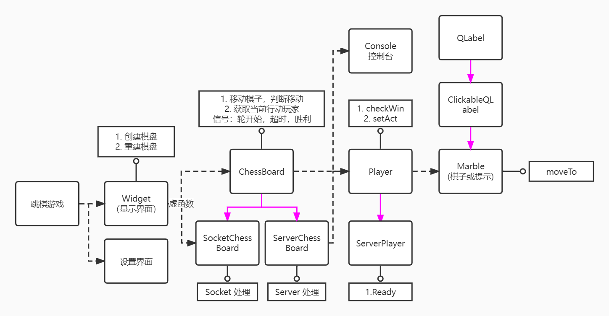
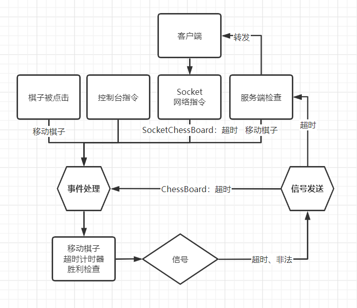
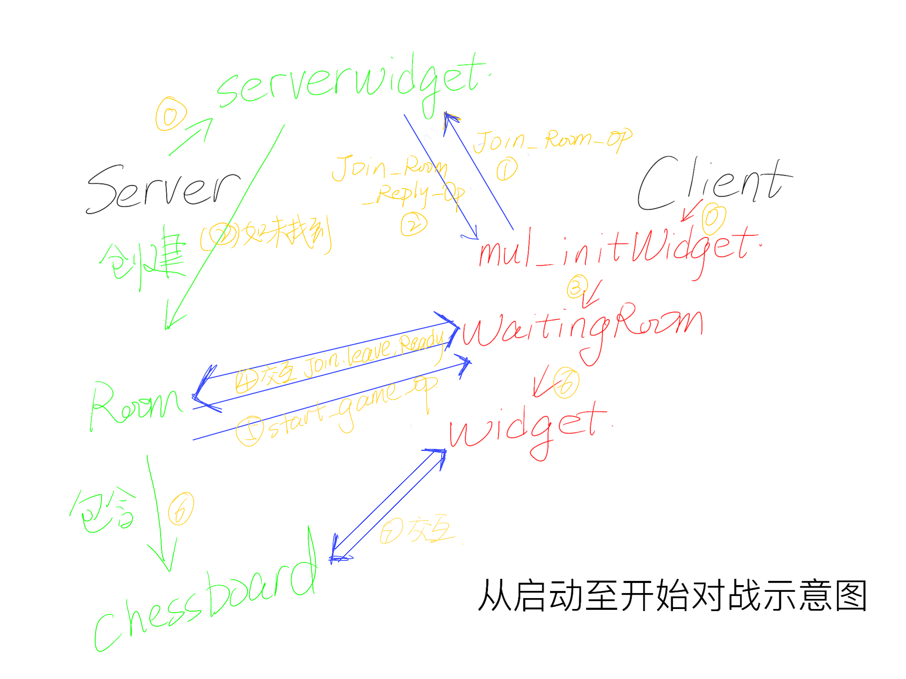
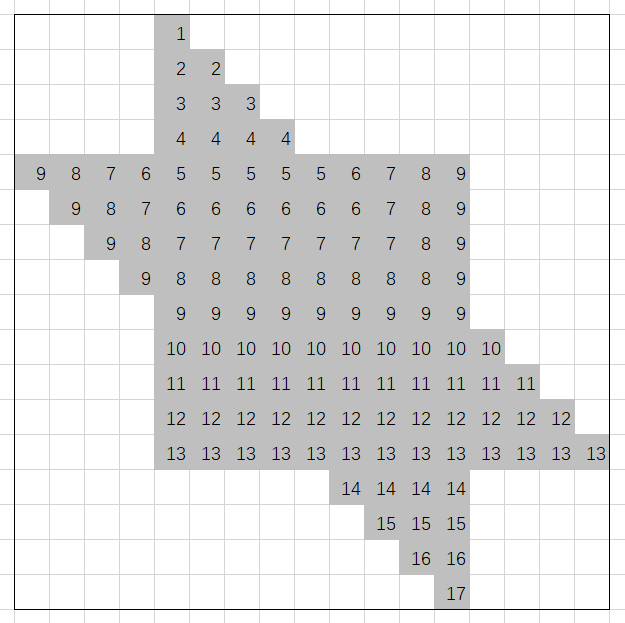
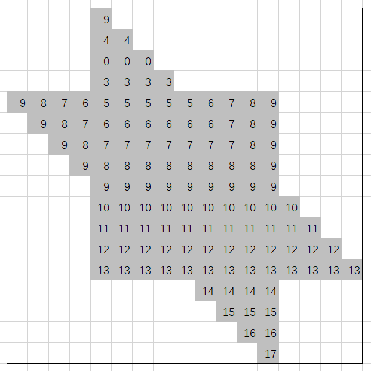
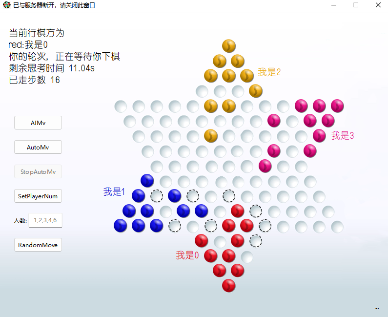
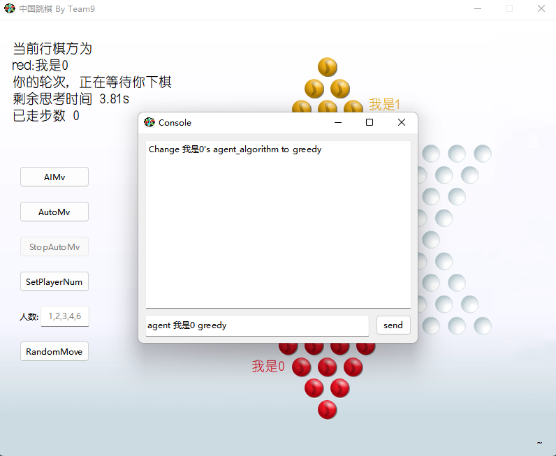
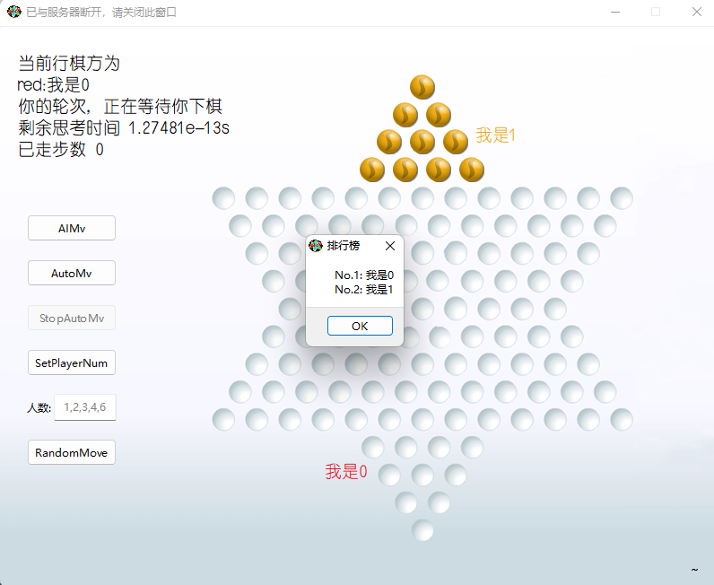
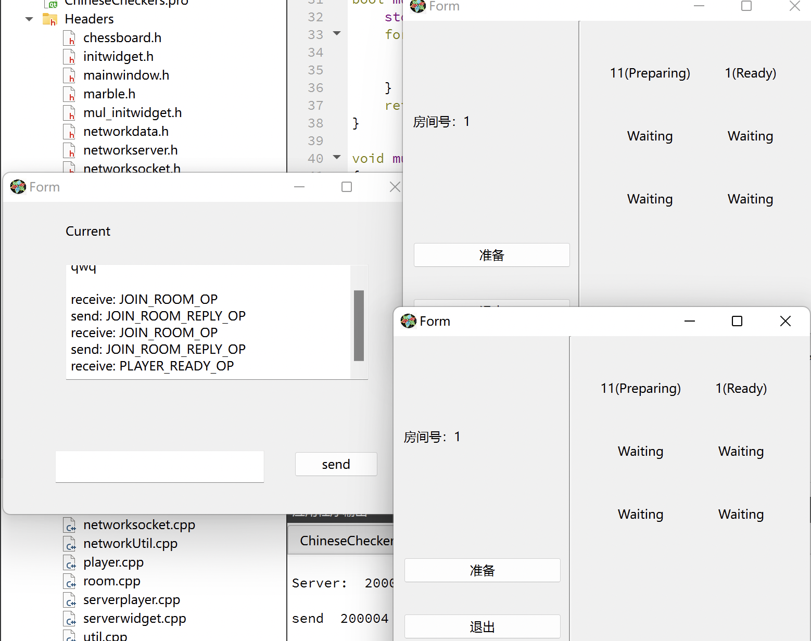

# ChineseCheckers

## 项目介绍
我们用 `Qt-C++` 设计并实现了一款带网络联机的交互良好的跳棋游戏。

项目的[文档](http://doc.panjd.net/)使用 `doxygen` 生成，包含完整的接口和类的继承关系

项目的[演示视频](https://www.bilibili.com/video/bv1dN4y1u7DL?vd_source=28602d173cf09845c54da253a564299c)发布在bilibili，展示了游戏流程和主要功能

代码发布在仓库 [StopInvolution/ChineseCheckers](https://github.com/StopInvolution/ChineseCheckers)
## 总体设计与分工
- 潘俊达(2021201626): 负责跳棋游戏功能与接口，跳棋底层逻辑和客户端，服务端跳棋信号处理
- 贾昊霖(2021201552): 负责房间实现，服务端跳棋信号收发，以及房间UI设计
- 程云飞(2021201506): 负责托管 AI 实现

> 具体分工可以参考[开发日志](#开发日志-基于commit记录整理)
## 模块设计
### 总体结构

蓝线代表派生关系，虚线代表所有关系，实线是功能或接口示例
### 棋盘设计
#### 框架设计
总体上我们有3种棋盘，离线棋盘，客户端棋盘，服务端棋盘，后两者由前者继承。我们通过信号槽机制，统一了三种棋盘的信号发送和相应的棋盘处理，实现上表现在发送信号的时机，或者信号槽连接不同。

我们用同一张图演示了这种机制在客户端棋盘，服务端(棋盘)，离线中的体现

在结构上，显示窗口 `Widget` 拥有棋盘 `ChessBoard` 和重置棋盘按钮，棋盘拥有玩家 `Player`，控制台 `ConsoleWidget` 和 托管按钮，玩家拥有棋子 `Marble`。

这种结构具备高度的拓展性，如同一窗口显示多张棋盘，或适应不同的跳棋规则。
#### 游戏逻辑
- 初始化棋盘
  
    通过 `{玩家:方位}字典` 和 `本地玩家列表` ，我们统一地处理初始化

- 玩家轮换

    通过 `nextTurn` 函数，我们会在每次行棋(包括超时移走所有棋子这种行棋)后自动切换到下一个玩家。我们借此维护一个 `activatedPlayer` 来完成判断，和控制一个玩家是否有权利在这个回合移动它的棋子。

- 行棋和判断

    玩家在自己的行动轮下选择一个棋子 `selectedChess` 后，会通过 `BFS` 计算出所有的可行棋位置，并且在对应位置放上一个 `hint-marble` 也就是提示棋子，它具有特殊的造型和点击事件。

    玩家接着点击某一提示棋子后，就会将 `selectedChess` 顺着 `BFS` 时存储的路径移动到对应位置上。

    所以玩家没有机会发出非法的行棋请求。

- 超时

    `nextTurn` 函数会重置一个计时器，计时器的超时事件是发出超时信号。处理函数的功能是移出这个玩家的所有棋子，并标记该玩家在 `nextTurn` 时跳过，同时移入犯规者列表。

- 获胜与终局判断

    检查行棋玩家的棋子是否全部进入终点的区域，是则标记玩家，并移入胜利者列表。

    当超时或获胜后，会对两个列表的玩家数量加和，达到玩家数-1就会发出终局信号，并处理排行榜。

- 托管

    `nextTurn` 函数会适时发出本轮是本人行棋的信号。托管的开关即实时连接和断开信号和托管运算函数的连接。

    值得注意的是，我们在实现中使用了多线程，以提升交互体验，另外我们还设计了完善的锁和解锁机制，前者可以防止在托管计算过程玩家手动行棋，导致最终二次行棋，后者可以解除锁，并标记托管无效，在托管线程结束时不会执行行棋。

- 旋转棋盘和回放

    旋转棋盘只需要改变棋盘坐标和窗口坐标的映射关系即可，在中间加入一个旋转变换。

    回放我们只需要存储行棋路线，并拓展棋子的移动函数，加入一个自销毁机制即延迟调用析构函数即可。
#### 离线，客户端与服务端多态设计
客户端和服务端棋盘分别继承自离线棋盘，并用虚函数实现多态。

- 离线棋盘

    发出的信号和处理函数槽在同一个对象内连接。

- 客户端棋盘

    收到网络通讯后，通过网络处理函数去调用对应的处理函数。

- 服务端棋盘

    发出的信号不仅和处理函数槽自连接。同时外部的服务器也会将这个信号连接到广播函数上，实现广播功能。
#### 玩家
玩家分为提示玩家和游戏玩家，其中提示玩家拥有提示棋子。通过提示玩家我们可以统一提示标志和正常棋子的控制方法。

玩家还拥有一个托管函数指针，可以借此修改托管的算法。同时玩家还存储起点，终点，姓名，上一次行棋路径等信息。

玩家类还被派生出服务器玩家

#### 控制台和托管
我们将正常游戏相关的功能通过按钮和编辑框的方式放置在游戏界面上。

将开发者功能，或高级功能放到了控制台里。

控制台可以实现例如上帝模式(使得每个位置都成为合法行棋位置)，切换AI算法，强制移动棋子等。
### 网络设计
#### 整体框架

整个流程中我们选择了**大厅-房间-战局**的结构，用户可以选择 _创建新房间_ 以生成一串16进制形式数字作为房间号，也可以选择 _加入房间_ 尝试进入指定房间号的房间。对战结束后，玩家关闭棋盘即可返回主界面并开始下一次游玩。服务端将房间和战局组合成一个整体，对客户端信号作出回应。

#### 客户端

在客户端创建时，程序立即在内存空间申请一个 `NetworkSocket`。这个套接字生命周期将与与客户端多人游戏界面生命周期保持一致。

通过在不同窗口之间传递 `NetworkSocket`，我们保证了多个窗口都可以收到 server 发出的数据；通过 `connect` 和 `disconnect`，我们确保所有数据在同一时间有且只有一个窗口作出响应。

#### 服务端

在服务端处理上，我们选择了可拓展性比较强的一种写法：在`ServerWidget` 中维护一个 `QVector<Room> roomList` 存储当前所有房间；接收消息之后找到对应房间再进行后续操作。

此外，我们还在服务端内设计了控制台，控制台内可以输入指令实现诸如强制开始游戏，踢出玩家或打印玩家信息等一系列操作。

#### 信号处理

在服务端上，我们选择了**服务端接收-棋盘处理-服务端发射**的运作方式，服务端通过调用函数向棋盘传递信息，棋盘则通过发射信号告知服务器相关操作的结果或间接发送数据，指挥服务器反馈，同时自身启动棋盘窗口实时展示。

在客户端处，在比赛开始前，信号由大厅界面和房间界面处理，开始游戏后，套接字会被转交给战局界面：我们选择的运作方式是**转交`socket`至棋盘**，让 `widget` 对信号进行处理。

### AI设计

我们采用了优化的Minimax算法作为默认的AI算法，另外有贪心算法供选择，以进行对比调试。

#### 贪心算法

我们首先实现了贪心算法，只选择下一步使棋子前进最远的行棋路线。棋子前进距离的“远”由始末位置在下表所示的dist数组中值的差衡量。dist数组的意义为，每个位置的dist值等于其前往目的地尽头处位置的单步跳跃步数。

我们没有加入棋子的中心轴偏移惩罚，因为六边形行棋下，离中心轴较近或较远的的棋子可能离目的地有相同的跳跃步数，难以证明这类惩罚的正确性。

<!--
|    |    |    |    |  1 |    |    |    |    |    |    |    |    |    |    |    |    |
|    |    |    |    |  2 |  2 |    |    |    |    |    |    |    |    |    |    |    |
|    |    |    |    |  3 |  3 |  3 |    |    |    |    |    |    |    |    |    |    |
|    |    |    |    |  4 |  4 |  4 |  4 |    |    |    |    |    |    |    |    |    |
|  9 |  8 |  7 |  6 |  5 |  5 |  5 |  5 |  5 |  6 |  7 |  8 |  9 |    |    |    |    |
|    |  9 |  8 |  7 |  6 |  6 |  6 |  6 |  6 |  6 |  7 |  8 |  9 |    |    |    |    |
|    |    |  9 |  8 |  7 |  7 |  7 |  7 |  7 |  7 |  7 |  8 |  9 |    |    |    |    |
|    |    |    |  9 |  8 |  8 |  8 |  8 |  8 |  8 |  8 |  8 |  9 |    |    |    |    |
|    |    |    |    |  9 |  9 |  9 |  9 |  9 |  9 |  9 |  9 |  9 |    |    |    |    |
|    |    |    |    | 10 | 10 | 10 | 10 | 10 | 10 | 10 | 10 | 10 | 10 |    |    |    |
|    |    |    |    | 11 | 11 | 11 | 11 | 11 | 11 | 11 | 11 | 11 | 11 | 11 |    |    |
|    |    |    |    | 12 | 12 | 12 | 12 | 12 | 12 | 12 | 12 | 12 | 12 | 12 | 12 |    |
|    |    |    |    | 13 | 13 | 13 | 13 | 13 | 13 | 13 | 13 | 13 | 13 | 13 | 13 | 13 |
|    |    |    |    |    |    |    |    |    | 14 | 14 | 14 | 14 |    |    |    |    |
|    |    |    |    |    |    |    |    |    |    | 15 | 15 | 15 |    |    |    |    |
|    |    |    |    |    |    |    |    |    |    |    | 16 | 16 |    |    |    |    |
|    |    |    |    |    |    |    |    |    |    |    |    | 17 |    |    |    |    |
-->

其中棋子从下方出发前往上方，距离目的地约近dist值越小。

#### Minimax算法：估值函数

##### 0.棋局阶段分类

我们将一盘跳棋分为三个阶段：开局OPENING、中盘MIDDLE、终局ENDING，因为这三个阶段中的行棋策略具有不同特征。根据经验，$n$人局的开局阶段结束于$10n$步左右，终局阶段开始于$20n+20$步左右。

估值函数为以下三项之和。

##### 1.前进距离

与贪心算法相同，前进距离由dist数组计算得出。实践中为了奖励棋子进入目的地，进一步减小了目的地处的dist值。

<!--
|    |    |    |    | -9 |    |    |    |    |    |    |    |    |    |    |    |    |
|    |    |    |    | -4 | -4 |    |    |    |    |    |    |    |    |    |    |    |
|    |    |    |    |  0 |  0 |  0 |    |    |    |    |    |    |    |    |    |    |
|    |    |    |    |  3 |  3 |  3 |  3 |    |    |    |    |    |    |    |    |    |
|  9 |  8 |  7 |  6 |  5 |  5 |  5 |  5 |  5 |  6 |  7 |  8 |  9 |    |    |    |    |
|    |  9 |  8 |  7 |  6 |  6 |  6 |  6 |  6 |  6 |  7 |  8 |  9 |    |    |    |    |
|    |    |  9 |  8 |  7 |  7 |  7 |  7 |  7 |  7 |  7 |  8 |  9 |    |    |    |    |
|    |    |    |  9 |  8 |  8 |  8 |  8 |  8 |  8 |  8 |  8 |  9 |    |    |    |    |
|    |    |    |    |  9 |  9 |  9 |  9 |  9 |  9 |  9 |  9 |  9 |    |    |    |    |
|    |    |    |    | 10 | 10 | 10 | 10 | 10 | 10 | 10 | 10 | 10 | 10 |    |    |    |
|    |    |    |    | 11 | 11 | 11 | 11 | 11 | 11 | 11 | 11 | 11 | 11 | 11 |    |    |
|    |    |    |    | 12 | 12 | 12 | 12 | 12 | 12 | 12 | 12 | 12 | 12 | 12 | 12 |    |
|    |    |    |    | 13 | 13 | 13 | 13 | 13 | 13 | 13 | 13 | 13 | 13 | 13 | 13 | 13 |
|    |    |    |    |    |    |    |    |    | 14 | 14 | 14 | 14 |    |    |    |    |
|    |    |    |    |    |    |    |    |    |    | 15 | 15 | 15 |    |    |    |    |
|    |    |    |    |    |    |    |    |    |    |    | 16 | 16 |    |    |    |    |
|    |    |    |    |    |    |    |    |    |    |    |    | 17 |    |    |    |    |
-->

一个局面的前进距离估值为$totalMyAdvance \times enemyCount - totalEnemyAdvance$。

为提高性能，减少重复计算，前进距离估值在Minimax搜索同时进行计算，作为中间参数在搜索树上从根向叶传递。本方的每一步棋的贡献为$myAdvance \times enemyCount$，敌方的每一步棋贡献为 $ - enemyAdvance$。

##### 2.行棋潜力

前进距离估值相同的两个棋局，人判断的好坏并不一定相同，这是因为它们棋形不同，导致下一步、下下步乃至之后的行棋潜力有差别。搜索、计算行棋后局面中每个棋子再走一步的最大前进距离。取最大的$POTENTIALCOUNT$个值，加权求和后乘以$RATEOFPOTENTIAL$(系数)。

具体地，$RATEOFPOTENTIAL$与棋局阶段有关，开局时此系数最大以奖励形成好的棋形；终局时不考虑，因为最终没有棋子可以继续前进，总潜力会下降到0。

##### 3.最落后棋子前进距离

初步设计时，本项为棋子dist值的极差，但具体一盘好棋内棋子的极差应该是多少，很难给出一个统一标准。因此改进此项为最落后棋子的前进距离，用来惩罚一两个棋子落在最后的情况。

一个局面相对于开始局面的落后棋子前进值为$(nowMaxDist - originalMaxDist) \times RATEOFBACK$(系数)。

具体地，$RATEOFBACK$与棋局阶段有关，开局时系数较小或不考虑，终局时系数最大。

##### 各类系数的确定

通过控制台切换AI算法，使两个不同系数的AI对战，辅以人工判断确定最优系数。

#### Minimax算法：优化

##### Alpha-beta剪枝

具体原理不再赘述。

##### 不考虑后退

实际棋局中很难出现后退的下法，这一项优化在几乎不减弱性能的同时约能减少$1/3$的每步可行走法。

##### “行棋潜力”项近似

在每一个局面都搜索一遍可行下法、计算行棋潜力，时间开销太大。因此，可以将Minimax搜索树上一叶子节点的最近Max祖先节点的行棋潜力值近似作为该叶子节点的行棋潜力值。Max节点代表本方行棋，故可以在搜索可行下法的同时顺便计算行棋潜力。在两人或三人游戏中，近似前后只有一两步行棋的差别，行棋潜力改变的情况很少（因为不是每个棋子都统计，只计算最大的$POTENTIALCOUNT$项）。这一项优化在两人或三人游戏中只减弱较少性能并大幅提高效率。

#### Minimax算法的时限控制

称以搜索树根节点的一个子节点为根的子树为一个“搜索候选”。通过为每个搜索候选计时，以此估计剩余的搜索时间并与剩余时间比较，动态调整下一搜索候选的Minimax搜索深度，以最好利用时限，提高搜索性能。

平均每局面的搜索候选数由总搜索候选数除以搜索节点数得出，用于计算搜索深度变化。

具体地：

$$estimateTime = thisCandidateTime \times unsearchedCandidateCount$$

$$averageCandidateCount = \frac{totalCandidate}{totalDfsNode}$$

$$depthChange = \lfloor log_{averageCandidateCount} \frac{restTime}{estimateTime} \rfloor$$

### 其他设计
#### 返回主界面机制
子窗口打开后，我们会隐藏主窗口。为了实现关闭子窗口后回到主窗口的功能，我们在全局管理了各个窗口的指针。

#### 设置
我们用文件存储了设置信息，方便下次复用

## 游戏功能说明与展示
### 游戏功能
1. 有2,3,4,6个玩家的棋盘&重置棋盘
2. 可行棋位置提示

    

3. 行棋动画

    使用Qt动画库
4. 随机移动

5. AI托管

    单步 和 全程托管
    
    同时支持强制中断，放弃执行还未计算完成的托管

    支持切换算法，如控制台输入 `agent username greedy`

6. 控制台

   

7. 上帝模式

    控制台中输入 `god 1` 打开

8. 棋盘旋转
9.  行棋回放

    点击玩家姓名即可回放其上一步行棋

10. 超时判负
11. 终局判断

    这里展示因超时判负而决出胜负的场景

    
### 网络功能
1. 服务器/客户端房间连接与信息展示
2. 控制台

    

## 开发笔记
### 如何正确使用前向定义使用相互包含的类
为了模仿 `Qt` 绑定父对象的结构，我们也进行了类似的设计，结果出来了头文件需要相互包含的问题，解决方案如下。

在 `.h` 文件里，我们只进行最简单的定义，在 `.cpp` 文件里再 `#include<...>` 对应的头文件以使用类

### 为耗时任务设计多线程
耗时任务会阻塞线程，导致 UI 无法正常操作，所以我们学习并使用了多线程来分离耗时任务，这也是图形化界面常用的操作。

### `socket` 所有权转移
我们应该尽可能使用 `new` 的方法来生成对象方便移交所有权。我们在移交时会进行响应的信号槽断开，和连接新信号的操作。提高鲁棒性，避免如在游戏阶段误处理服务器错误发送的房间指令。

## 开发日志 (基于commit记录整理)
- 2022-03-11 停止内卷小组正式组建，新建文件夹 `ChineseCheckers`，开始学习 `Qt`。
---
- 2022-03-14 确定 `ChessBoard`，`Player`，`Marble` 的设计架构。设计部分素材。【潘俊达】
- 2022-03-15 实现棋子和背景的显示。【潘俊达】
- 2022-03-16 实现了行棋合法性判断。重构代码，解决类之间 `circular reference` 的问题。【潘俊达】
- 2022-03-17 实现选子、落子、提示棋子、玩家轮换、信息显示等操作。跳棋基本框架完成。【潘俊达】
- 2022-03-18 实现2/3/4/6玩家数，托管(随机移动)，棋子移动动画。【潘俊达】
- 2022-03-30 持续完善文档和注释，修复一些Bug。【潘俊达】
- 2022-04-09 设计棋子素材，完成棋子图片元素显示。【贾昊霖】
- 2022-04-15 增加了开始界面。【潘俊达】
- 2022-04-15 第一阶段完成。
---
- 2022-05-02 调整了坐标参考系。为棋盘增加了基于坐标而非对象的棋子移动接口。【潘俊达】
- 2022-05-03 实现超时功能。【潘俊达】
- 2022-05-05 初步实现了客户端和服务端房间连接逻辑和窗口设计。【贾昊霖】
- 2022-05-05 实现基于网络协议的棋盘初始化接口。【潘俊达】
- 2022-05-05 完善了房间连接和提示功能，修复若干BUG。【贾昊霖】
- 2022-05-11 实现终局判断以及排名展示。【潘俊达】
- 2022-05-11 实现客户端棋盘接收并处理网络数据。【潘俊达】
- 2022-05-12 完善客户端网络交互逻辑，优化对局信息显示。【潘俊达】
- 2022-05-13 实现棋盘中游戏状态信号发送。对接服务端。【潘俊达】
- 2022-05-03 连接服务端棋盘，转发信息。【贾昊霖】
- 2022-05-13 第二阶段完成。
---
- 2022-05-14 增加了托管接口。【潘俊达】
- 2022-05-19 实现了贪心 AI 和坐标旋转。【程云飞】
- 2022-05-21 增加了客户端控制台。实现了旋转视角，回放行棋。更新了时间戳机制。【潘俊达】
- 2022-06-05 实现设置信息记录。【贾昊霖】
- 2022-06-10 实现双人 ab 剪枝 minmax 搜索 AI。【程云飞】
- 2022-06-20 为 AI 托管实现多线程。【潘俊达】
- 2022-06-25 重构了房间，完善了退出机制。【贾昊霖】
- 2022-06-26 分离并重构了服务端棋盘。【潘俊达】
- 2022-06-28 优化了按钮逻辑。【潘俊达】
- 2022-06-28 实现3人AI，加入动态调节深度的功能。【程云飞】
- 2022-06-28 第三阶段完成。
